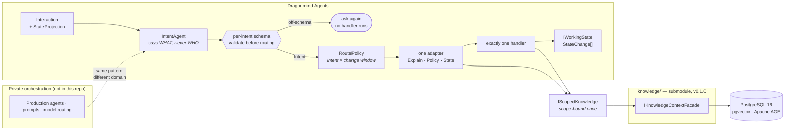

# Dragonmind Agents Sample

Dragonmind is a multi-agent platform. This repository is its **orchestration pattern**, on a neutral
domain, with every prompt written fresh for it: a model reads one turn and says what kind of request
it is, deterministic code decides which agent handles it, and a typed adapter builds that agent's
input. The production agents, their prompts and the model routing are private and are **not** here.
The other half of the story is [dragonmind-knowledge](https://github.com/nathangeranis/dragonmind-knowledge) —
the scoped memory these agents read and write — which this repository consumes as a pinned
submodule rather than a fork.

The domain is a steward for a fleet of running services. It is made up; the shape around it is not.

The pattern itself is about twenty minutes: the README, then `TurnOrchestrator.RunAsync`, then one
handler and its adapter. Reading every file properly is closer to forty — the three handlers are
deliberately the same shape, so the second and third are a skim once the first has landed.

## Architecture



The classifier's output type cannot name a handler, and the routing policy reads state the classifier
was never shown. Both are enforced by tests, not by convention.

## Run it

No API key, no network, no database:

```bash
git clone --recurse-submodules https://github.com/nathangeranis/dragonmind-agents-sample.git
cd dragonmind-agents-sample
dotnet run --project src/Dragonmind.Agents.Sample
```

The memory layer is a submodule, and the solution references its projects by relative path. Without
`--recurse-submodules` the `knowledge/` directory is empty and the restore fails on a missing
project; `git submodule update --init --recursive` fixes it after the fact.

The unit tests need nothing but the SDK:

```bash
dotnet test tests/Dragonmind.Agents.UnitTests
```

The integration tests need the real knowledge layer — PostgreSQL with pgvector and Apache AGE, built
from the submodule's own image definition:

```bash
docker compose up -d --wait db
export STEWARD_TEST_CONNECTION="Host=localhost;Port=5456;Database=steward;Username=steward"
dotnet test tests/Dragonmind.Agents.IntegrationTests
```

They read that one variable and fail loudly when it is missing rather than skipping — a suite that
quietly no-ops when the database is unreachable reports green while proving nothing. Everything in
one command, including the database:

```bash
docker compose --profile test up --build --exit-code-from tests
```

To point the same code at a real model, set three variables and change nothing else:

```bash
export AGENTS_SAMPLE_MODEL_ENDPOINT="https://your-openai-compatible-endpoint/v1"
export AGENTS_SAMPLE_MODEL_API_KEY="..."
export AGENTS_SAMPLE_MODEL="your-model-id"
```

No provider is the default, no model is named anywhere in this repository, and there is no
key-shaped string in it. The database container binds to `127.0.0.1` with trust auth, so there are
no credentials either.

## A turn, per intent

Captured from `dotnet run --project src/Dragonmind.Agents.Sample` with nothing configured. The model
replies are canned, so this run is reproducible verbatim; the classification, routing and state
changes are the real code doing the real thing.

```text
fleet steward - scripted model, no key and no network

> what depends on payments-db?
  intent  : StateQuery
  handler : Explainer
  orders-api depends on payments-db. payments-db is degraded, so orders-api is exposed to that.

  [The change window is CLOSED.]
> restart payments-db
  intent  : Action
  handler : Explainer
  I have not restarted payments-db. The change window is closed, so no change to the fleet can be made right now.

  [Same words as the turn above. The change window is now OPEN - and nothing else changed.]
> restart payments-db
  intent  : Action
  handler : Policy
  change  : HealthChanged { Service = payments-db, Health = Healthy }
  Restarting payments-db. orders-api depends on it and will see a brief interruption.

  [The steward already believes orders-api depends on payments-db. This turn reads that belief before adding to it.]
> orders-api talks to ledger-service as well, not just payments-db
  intent  : Correction
  handler : State
  Noted. I will treat orders-api as depending on both payments-db and ledger-service.

> save this as post-rollout
  intent  : Checkpoint
  handler : State
  Recorded the fleet as it stands under "post-rollout".

  [The classifier answers with an action naming no action - off-schema for the kind it chose.]
> do the thing with the stuff
  intent  : (not classified)
  handler : (none ran)
  I could not tell what you were asking for - an action request named no actions. Could you put it another way?

fleet after the run:
  orders-api 3.1.0 Healthy
  payments-db 11.2 Healthy
  ledger-service 1.4.2 Healthy

what the steward now believes about orders-api:
  orders-api DEPENDS_ON ledger-service
  orders-api DEPENDS_ON payments-db
```

Turns two and three are the same words of input reaching different agents. Nothing the model
produced distinguishes them.

## Design notes

### Why the model classifies and the code routes

The obvious shortcut is to let the model name its own destination — `handler: policy` as one more
field in its answer. It works in a demo and it costs you three things.

**You lose the ability to enumerate the policy.** Routing becomes a sentence in a prompt, and the
only way to learn what it does is to run it. Here it is eight rows:

| Intent | Change window open | Change window closed |
| --- | --- | --- |
| `Action` | `PolicyAgent` | `ExplainerAgent`, carrying a refusal |
| `StateQuery` | `ExplainerAgent` | `ExplainerAgent` |
| `Correction` | `StateAgent` | `StateAgent` |
| `Checkpoint` | `StateAgent` | `StateAgent` |

A test walks every cell asserting that exactly one rule matches — on the match *count*, so an
overlapping rule fails rather than being silently resolved by whichever was written first.
`RoutePolicy.Resolve` uses `Single`, not `First`, so an ambiguous or incomplete table throws at the
moment it is wrong rather than at the moment someone notices a turn went somewhere odd.

**You lose the ability to route on what the model cannot see.** The change window is not in
`StateProjection` at all. The classifier could not have routed turns two and three differently
because it was never told what distinguishes them. Anything the model must not condition on is a
field you simply do not project — and what it is allowed to know stays reviewable in one place
instead of being inferred from whatever a serializer happened to emit.

**You lose containment of a bad classification.** When the model picks the target, a confused answer
reaches an arbitrary agent with arbitrary arguments. Here the blast radius is bounded twice over:
an answer is validated against *its own intent's* schema before a route is resolved at all, and a
wrong-but-valid intent can still only reach a handler that was already a legal destination for it.
The off-schema path in the transcript above is the first of those — `actions[0]` is well-formed TOON
and a perfectly plausible answer, and it is refused because an action request that names no action
cannot be acted on. No handler ran, nothing was retrieved, nothing was written. There is deliberately
no default intent to fall back to: the cheapest wrong answer in a system like this is the one that
gets acted on.

### Why routing takes state as input

A routing function of intent alone would have to be wrapped in a guard inside each handler — *am I
allowed to do this right now?* — and that guard is a second copy of the policy, in three places,
that drifts.

Making the state an input instead keeps one answer to the question. `Action` during an open change
window goes to the policy handler; the same `Action` with the window shut goes to the explainer, and
the reason travels with it as data on the route. The explainer states that reason. It is not asked
whether to refuse and has no field it could use to reach a different conclusion, which is why the
refusal survives even a malformed model reply.

The input is deliberately one flag. The policy is exhaustively testable precisely because its domain
is small and finite — four intents by two window states is eight cells — and every field added there
multiplies the grid. Anything a handler can decide for itself belongs in the handler.

### Why every agent boundary is an adapter

**The production orchestrator does not do this.** It passes the classification result plus one
shared, mutable context object to whichever handler runs. That is worth being concrete about rather
than quietly improving on, because the shared-context version is genuinely less code and the costs
only show up later.

- *A handler's real inputs stop being visible.* With a shared context, learning what a handler
  depends on means reading its body and noting every field it touches. Here the request type is the
  answer, and it is one screen long.
- *Tests drift towards constructing the world.* Testing against a shared context means populating a
  shared context, including the parts the handler ignores — so every test acquires an opinion about
  fields it does not use, and breaks when they change.
- *Retrieval spreads.* Somebody has to fetch the passages and the facts. With a shared context it is
  tempting to fetch everything up front for every turn, because the assembly step does not know who
  will run. With an adapter it is that adapter's business: the explainer retrieves on the question
  and traverses the graph around the services the question names, the policy handler retrieves on the
  services being changed, and a checkpoint retrieves nothing at all.
- *Mutation becomes ambient.* A shared mutable context invites in-place edits, after which what a
  turn did is no longer a value anyone can inspect — only the difference between two states, which
  cannot distinguish "did nothing" from "did two things that cancelled out". Handlers here return
  `StateChange` values and the orchestrator applies them.

The adapter is also where an ordering guarantee lives that a comment could not enforce. A
`Correction` must consult the knowledge graph before it writes, so the facts are a *required field*
of the handler's request and the adapter fetches them. The handler cannot be called before the
lookup has returned, because it cannot be constructed without the result.

What this costs is real: four more types, and a new field needed by an existing handler has to be
threaded through its adapter rather than read off the context. That is the trade — an explicit edit
at a named boundary instead of a free read.

### Token spend

Most agent spend is prompt tokens, and two things here target it. Structured output uses
[TOON](https://github.com/toon-format/toon), which declares an array's length in its header and then
writes rows without repeating field names, instead of JSON. And every agent call carries only the
response schema for its own request type: the explainer's prompt describes one field, because that is
all an explanation is. Only the classifier carries all four shapes, because choosing between them is
its job.

No percentage is quoted. Measuring that properly means measuring real traffic against a real model,
and a number published without that is decoration.

### Adding a fifth intent

Four things move together, and the tests fail until the last of them is done:

1. a member on `Intent`;
2. a case on `IntentResult`, with whatever that intent carries;
3. a `ResponseSchema` entry — the worked example and the binding that validates it;
4. **two** rows in `RoutePolicy.ShippedRules`, one per change-window state.

Skip the last and `RoutePolicyTests` fails on the missing cell rather than the turn failing later at
run time. A fourth handler is the same shape: an interface, an adapter producing its own request
type, and rows pointing at it.

### What this is not

There is no tool calling here — no `AIFunction`, no `ChatOptions.Tools`, no function-invocation
middleware. Every agent makes one `GetResponseAsync` call with messages and options. Handlers reach
the knowledge layer through an ordinary constructor-injected port that binds the scope once, and
their adapters fold what comes back into the prompt. That mirrors the system this is drawn from, and
it is a deliberate position rather than an omission: retrieval decisions made in code are checkable
and do not vary run to run.

It is also not a benchmark, a framework, or a general-purpose agent library. It is one pattern,
small enough to read.

## Repository layout

| Path | What is in it |
| --- | --- |
| `src/Dragonmind.Agents` | The pattern: classification, routing, adapters, handlers, working state |
| `src/Dragonmind.Agents.Sample` | The composition root — the only project that knows a model provider exists |
| `tests/Dragonmind.Agents.UnitTests` | The suite that needs nothing, including the architecture tests |
| `tests/Dragonmind.Agents.IntegrationTests` | One `Correction` turn against the real knowledge layer |
| `knowledge/` | `dragonmind-knowledge`, submodule, pinned to `v0.1.0` |
| `.claude/` | The instructions, skills and subagents this repository was built with |

## License

MIT — see [LICENSE](LICENSE). Third-party components, including the TOON serializer and the
knowledge-layer submodule, are listed with their own licences in [NOTICE](NOTICE).
